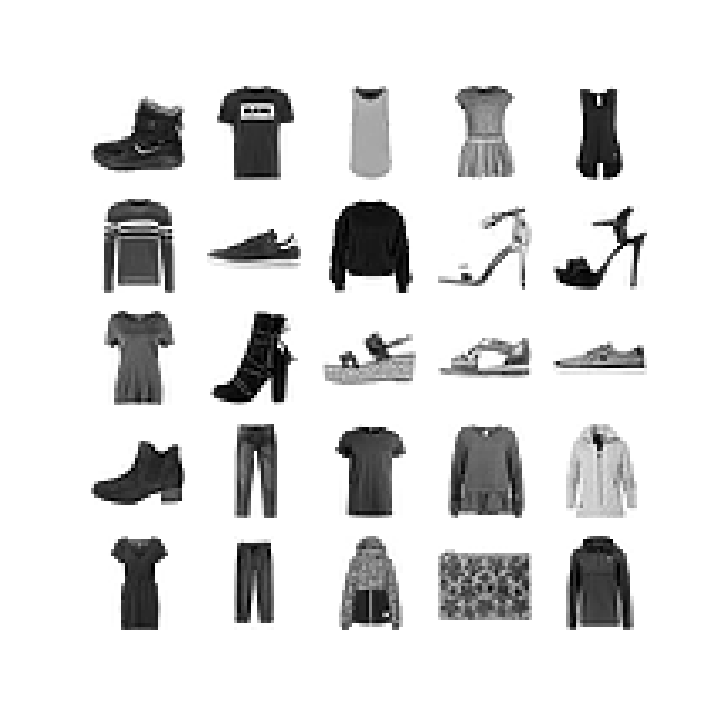

# Fashion-clothes-Recoginition--using-CNN
Fashion-Clothes-Recoginition--using-CNN

---


## **Installation**

### Copy and Run this in terminal: 

```
pip3 install -r requirements.txt

git clone https://github.com/kanishksh4rma/Fashion-clothes-Recoginition--using-CNN.git
```


---

### Libraries used : 

```
  * pandas
  * matplotlib
  * sklearn
  * keras
```
---

## Algorithms Used

The Algorithms used are : 

	* Convolutional Neural Network (CNN)

 ---

# Screenshots :


---

# ***Accuracy*** : 


---

> Developed by: [Kanishk Sharma](github.com/kanishksh4rma)

[](https://github.com/kanishksh4rma/Parkinson-Disease-Prediction-in-Early-Stages)
